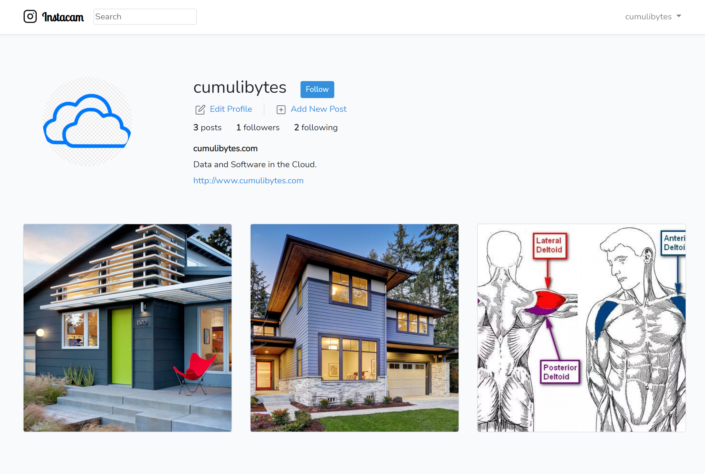

  

# Instacam - An instagram-clone

An instagram-clone built with PHP Laravel, Javascriopt and CSS.

## General info

This project is a simple demonstration of using Laravel.

### Educational Purpose

This project was for educational purposes inspired by the freecodegram project: https://www.freecodecamp.org/news/laravel-full-course/
